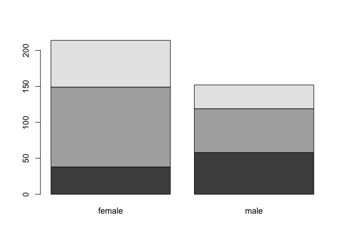
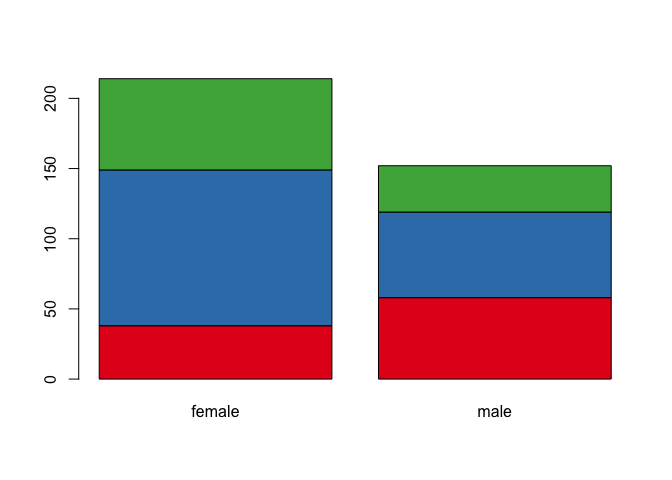
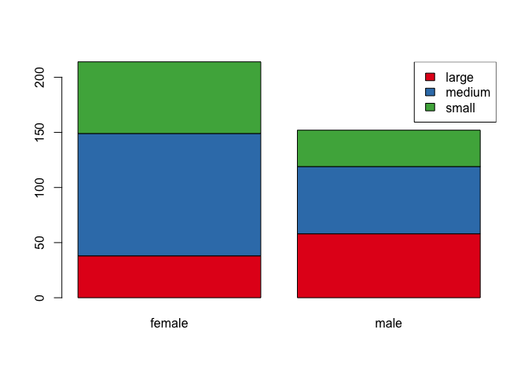

# 5. Statistical tests

We have so far performed an **exploratory** or **descriptive** analysis of the data. This is the first important step! 
Usually, in a second step, we want to test some statistical hypothesis: do women have lower cholesterol level compared to men? Are height and weight significantly correlated? Are there significantly more men from Buckingham compared to women?
We do not want to given a statistics class, but we will see how to answer these 3 questions using R functions!


## 5.1. Testing the mean

This is the most widely used class of statistical tests; we use them to test the value of the mean of a vector of numerical values. Let us test if men have significant different cholesterol values compared to women!

First, we have to exactly define the question we want to answer; we have three possible questions:

1. Do men have a significant **higher** cholesterol level?
2. Do men have a significant **lower** cholesterol level?
3. Do men have a significant **different** cholesterol level?

Notice the difference? The first 2 questions correspond to **one-sided** tests, as we indicate throught the question that we want to check for difference in a specific direction. The third question corresponds to a **two-sided** test, as we do not specify in which direction we expect the difference. 

**Important: Make sure to specify the question before you start doing your test!!**

If we have no reason to expect the changes to be in one or the other direction, we go for a two-sided test.

We read again the data matrix:


```r
dat = read.delim("https://tinyurl.com/87tpvd4c", stringsAsFactors = TRUE)
```

We first create a vector of cholesterol levels for men an women separately. We use here again the very usefull function `split()` :


```r
cholesterol = split(dat$chol, dat$gender)
```

> Check the type of the cholesterol object!

We now perform a **t-test** comparing these 2 vectors:


```r
t.test(cholesterol$female, cholesterol$male)
```

```

	Welch Two Sample t-test

data:  cholesterol$female and cholesterol$male
t = 0.85404, df = 314.56, p-value = 0.3937
alternative hypothesis: true difference in means is not equal to 0
95 percent confidence interval:
 -5.249704 13.302582
sample estimates:
mean of x mean of y 
 209.1449  205.1184 
```

> Check the output of the test; do you understand the information given here?
> What is the meaning of the *alternative hypothesis* line?
> Does the test seem to be significant?


There are multiple pieces of information in this output:

* The header indicates that we performed a **Welch two-sample t-test**; the Welch version of the t-test (as opposed to the Student version) assumes that the variance of the two samples are different.
* The second line of the output gives the value of the test statistics (t), and the p-value. Make sure to define the significance level alpha before! Usually, we choose 0.05 as a significance level
* When you state the question you want to ask, you automatically formulate the H0 hypothesis. If you ask "Do men have a different cholesterol level?", the the H0 hypothesis is "Mean have a similar cholesterol levels to women" or "The difference in the mean cholesterol levels between the two groups is 0"; the third line formulates the alternative hypothesis (or H1). This would be valid if the test turns out to be significant!
* The **95 percent confidence interval** indicates the 95 CI of the true difference of the means
* The last line gives the means of the two samples.

How would we perform a one-sided t-test? Let's suppose we want to test if men have a higher cholesterol level compared to women:

* Question: do mean have a significantly higher cholesterol level compared to women?
* H0: No, men do not have a higher cholesterol level compared to women
* H1 (or alternative): Men do have a significantly higher cholesterol level compared to women.

The R command reads:


```r
t.test(cholesterol$male, cholesterol$female, alternative = "greater")
```

```

	Welch Two Sample t-test

data:  cholesterol$male and cholesterol$female
t = -0.85404, df = 314.56, p-value = 0.8031
alternative hypothesis: true difference in means is greater than 0
95 percent confidence interval:
 -11.80418       Inf
sample estimates:
mean of x mean of y 
 205.1184  209.1449 
```

Beware that the `alternative='greater'` refers to the first sample indicated in the function! So here, the order matters!

### Exercice: 

Test if men have a significantly higher weight compared to women!

<details>
<summary><b>Click here for solution!</b></summary>


```r
weights = split(dat$weight, dat$gender)
t.test(weights$male, weights$female, alternative = "greater")
```

Check again the corresponding violin plot!
</details> 
<p></p>


## 5.2 Correlation tests

We have previously computed the correlations between the numeric variables, and displayed them as heatmaps. Now, even if the correlation is non zero, maybe the correlation is not really significant. Hence, it does not indicate a strong relationship between the 2 variables... Let's see an example:

* Compute the correlation between the variables `height` and `waist`


```r
cor(dat$height, dat$waist)
```

```
[1] 0.04180787
```

Non zero, but not very large... But sometimes (if you have many values), a small correlation can be significant, despite being small.

We can check this with the function `cor.test`:


```r
cor.test(dat$height, dat$waist)
```

```

	Pearson's product-moment correlation

data:  dat$height and dat$waist
t = 0.79834, df = 364, p-value = 0.4252
alternative hypothesis: true correlation is not equal to 0
95 percent confidence interval:
 -0.06096349  0.14370208
sample estimates:
       cor 
0.04180787 
```

> Check again the different pieces of the output, and try to interpret them!

Well, nice  try, but these 2 variables indeed do not seem to be significantly associated!

> Try to find two variables with a significant correlation; maybe you can inspect the previous heatmap to guess which could be interesting to check!


## 5.3 Proportion tests

As the name indicates, we use these types of tests to compute the relationship between **categorical** variables. In particular, we can test if the *proportions* in different categories are significantly different.

Let us see an example: are there significantly more men coming from  Buckingham compared to women?

You might know that the starting point for these types of test are **contingency** matrices; here, that you be a 2x2 matrix with columns indicating men/women and rows indicating Buckinham/Louisa (or vice-versa). We can easily produce such a table with the .... `table` function:


```r
T = table(dat$gender, dat$location)
T
```

```
        
         Buckingham Louisa
  female        102    112
  male           73     79
```

Now, there are two tests we can use for this kind of question:

1. Fisher-exact test
2. Chi-square test.

Let us try both of them, to see if they agree!


```r
fisher.test(T)
```

```

	Fisher's Exact Test for Count Data

data:  T
p-value = 1
alternative hypothesis: true odds ratio is not equal to 1
95 percent confidence interval:
 0.636320 1.527029
sample estimates:
odds ratio 
 0.9856036 
```


```r
chisq.test(T)
```

```

	Pearson's Chi-squared test with Yates' continuity correction

data:  T
X-squared = 0, df = 1, p-value = 1
```

Well, they do... Absolutely non significant!


> Test if the proportion of small/medium/large value in the `frame` variable depends on the gender....
> What type of plot could we use to visualize this?

<details>
<summary><b>Click here for solution!</b></summary>


```r
## build the contigency table
T = table(dat$frame, dat$gender)

## perform test
chisq.test(T)
```

```

	Pearson's Chi-squared test

data:  T
X-squared = 19.199, df = 2, p-value = 6.777e-05
```

So there is a significant relations between gender and the frame variable! Hence the proportions are unequal!

We can try to do a **barplot** to visualize these differences, in particular a **stacked barplot**


```r
barplot(T)
```

<!-- -->

Nice, but we could choose nicer colors!


```r
library(RColorBrewer)
col.frame = brewer.pal(3, "Set1")
```


```r
barplot(T, col = col.frame)
```

<!-- -->

By the way, can we add a legend??


```r
barplot(T, col = col.frame)
legend("topright", legend = rownames(T), fill = col.frame)
```

<!-- -->

Nice!!

</details>
<p></p>


#### Exercise: correlation heatmap for expression values

1. compute the pairwise correlation between all patients in the `all.aml` dataset
2. plot the heatmap; use the `annotation_row=...` argument to add additional information
3. select a pair of positively/negatively correlated patients; determine if the correlation is significant

[Previous Chapter (Plotting)](./04_plotting.md)