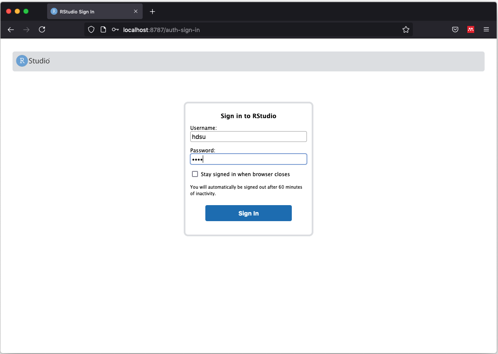
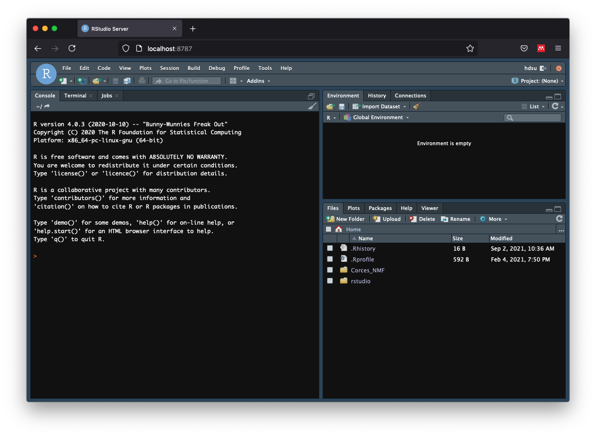
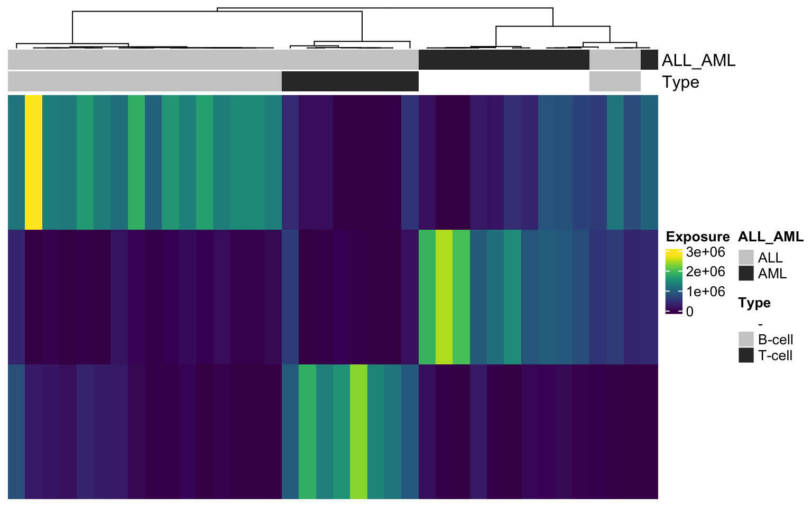

# Test ButcherR-[BC]<sup>2</sup> Docker image

After running the ButcherR-[BC]<sup>2</sup> Docker image (see [Run Docker image hdsu/butcher-bc2](./01_run_image.md)), you can run the following short example with a small leukemia dataset to test it.

## Step 1 - Sign in to Rstudio

With the app open, sign in to RStudio using the following credentials:  
- Username: hdsu  
- Password: pass

<details>
<summary><b>Click for Answer</b></summary>

|  | 
|:--:| 
| *To start use "hdsu" as username and "pass" as password* |
||

|  | 
|:--:| 
| *Screen you should see after logging in to RStudio* |
||


</details>


## Step 2 - Load packages

Run the following lines to load the required packages:

``` r
library(ButchR)
library(ComplexHeatmap)
library(viridis)
library(tidyverse)
```

# Step 3 - Load leukemia data

Load the example data

``` r
data(leukemia)
```

Now we are ready to start an NMF analysis.


## Step 4 - run NMF 

The wrapper function for the NMF solvers in the ButchR package is
`run_NMF_tensor`. It is called as follows:

``` r
k_min <- 2
k_max <- 4

leukemia_nmf_exp <- run_NMF_tensor(X = leukemia$matrix,
                                   ranks = k_min:k_max,
                                   method = "NMF",
                                   n_initializations = 10, 
                                   extract_features = TRUE)
```


<details>
<summary><b>Click for Answer</b></summary>

#### H matrix for k= 3

```
    ## [1] "2020-07-16 17:50:42 CEST"
    ## Factorization rank:  2 
    ## [1] "NMF converged after  75,123,64,69,58,126,141,83,54,87 iterations"
    ## [1] "2020-07-16 17:50:42 CEST"
    ## Factorization rank:  3 
    ## [1] "NMF converged after  154,79,90,87,66,84,76,151,115,102 iterations"
    ## [1] "2020-07-16 17:50:44 CEST"
    ## Factorization rank:  4 
    ## [1] "NMF converged after  108,189,202,108,121,76,104,150,110,132 iterations"
    ## No optimal K could be determined from the Optimal K stat
```


</details>


Depending on the choice of parameters (dimensions of the input matrix,
number of iterations), this step may take some time. Note that the
algorithm updates the user about the progress in the iterations.

### Step 5 - Normalize W matrix

To make the features in the *W* matrix comparable, the factorization is
normalized to make all columns of *W* sum 1.

``` r
leukemia_nmf_exp <- normalizeW(leukemia_nmf_exp)
```

### Step 6 - Visualize the matrix H (exposures)

The matrices `H` may be visualized as heatmaps. We can define a meta
information object and annotate meta data:

``` r
heat_anno <- HeatmapAnnotation(df = leukemia$annotation[, c("ALL_AML", "Type")],
                               col = list(ALL_AML = c("ALL" = "grey80", 
                                                      "AML" = "grey20"),
                                          Type = c("-" = "white",
                                                   "B-cell" = "grey80",
                                                   "T-cell" = "grey20")))
```

And now display the matrix `H` with meta data annotation:

``` r
#plot H matrix
tmp_hmatrix <- HMatrix(leukemia_nmf_exp, k = 3)
Heatmap(tmp_hmatrix,
        col = viridis(100),
        name = "Exposure",
        clustering_distance_columns = 'pearson',
        show_column_dend = TRUE,
        top_annotation = heat_anno,
        show_column_names = FALSE,
        show_row_names = FALSE,
        cluster_rows = FALSE)

```

<details>
<summary><b>Click for Answer</b></summary>

#### H matrix for k= 3



</details>