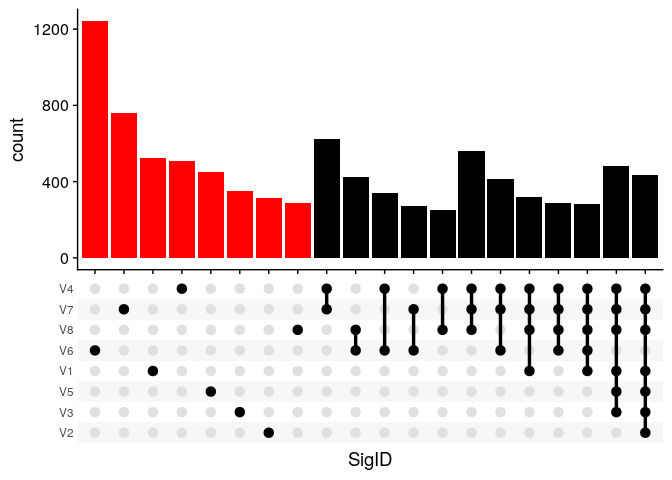
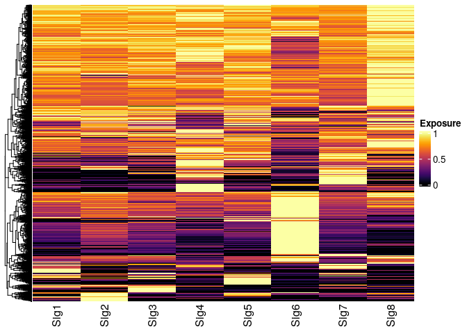
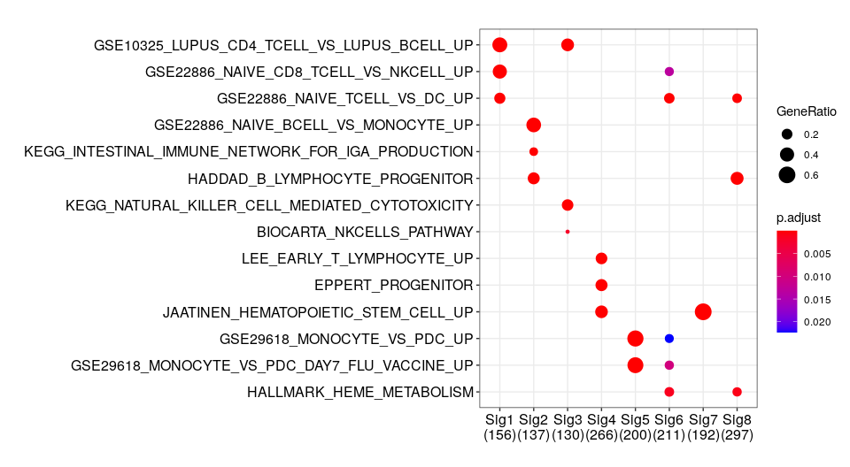

# Feature extraction and enrichment analysis

## Identification of signature specific features

ButchR has a complete suite of functions to identify the differential contribution of a feature to every signature, classifying them into signature specific features and multi-signature features. 

The function `SignatureSpecificFeatures` classifies one feature as non-contributing or contributing towards a signature definition, returning a binary matrix of features, where 0=non-contributing and 1=contributing.

```r
ss_features <- SignatureSpecificFeatures(rna_norm_nmf_exp, k = 8,return_all_features = TRUE)
ssf_gg <- ss_features %>% 
  as_tibble(rownames = "geneID") %>% 
  pivot_longer(cols = -geneID, names_to = "SigID", values_to = "IsSig") %>% 
  filter(IsSig == 1 ) %>% 
  dplyr::select(-IsSig ) %>% 
  group_by(geneID) %>%
  summarize(SigID = list(SigID)) %>% 
  ggplot(aes(x = SigID)) +
  geom_bar(fill=c(rep("red",8),rep("black",12))) +
  scale_x_upset(order_by = "degree", n_intersections = 20) +
  cowplot::theme_cowplot()
ssf_gg
```

<details>
<summary><b>Click for Answer</b></summary>


</details>


## Ectract top signature specfic features

Notice that when the return_all_features flag is not used, the function `SignatureSpecificFeatures` returns a list of associated features with every signature.

Visual inspection of the top 10% of the signature specific features (i.e., signature specific genes):

```r
ss_features <- SignatureSpecificFeatures(rna_norm_nmf_exp, k = 8)
ss_features <- do.call(c, ss_features)

wmatrix_norm <- WMatrix(rna_norm_nmf_exp, k = 8)
colnames(wmatrix_norm) <- paste0("Sig", 1:8)

##----------------------------------------------------------------------------##
##                        top 10% features Heatmap                            ##
##----------------------------------------------------------------------------##
top_10perc_assing <- function(wmatrix){
  sig_assign <- lapply(setNames(colnames(wmatrix), colnames(wmatrix)), function(sigID){
    selec_wmatrix <- do.call(cbind, lapply(as.data.frame(wmatrix), function(sign_expo){
      sign_expo[sign_expo < quantile(sign_expo, 0.9)] <- NA
      sign_expo
    }))
    rownames(selec_wmatrix) <- rownames(wmatrix)
    selec_wmatrix <- selec_wmatrix[!is.na(selec_wmatrix[,sigID]),,drop=FALSE]
    # Keep only the top feature if there's an overlap
    sig_SE_IDs <- rownames(selec_wmatrix[rowMaxs(selec_wmatrix, na.rm = TRUE) == selec_wmatrix[,sigID],])
    sig_SE_IDs
  })
  sig_assign
}
sign_features <- top_10perc_assing(wmatrix_norm)

wmatrix_norm_sel <- wmatrix_norm[do.call(c, sign_features), ]
dim(wmatrix_norm_sel)
```
<details>
<summary><b>Click for Answer</b></summary>

```
## [1] 7859    8
```
</details>


```r
Heatmap(wmatrix_norm_sel/rowMaxs(wmatrix_norm_sel), 
        col = inferno(100), 
        name = "Exposure",
        show_row_names = FALSE, 
        cluster_columns = FALSE )
```

<details>
<summary><b>Click for Answer</b></summary>


</details>


## Gene set enrichment analysis of signature specific features

Gene set enrichment analysis using the same set of genes displayed in the previous heatmap. -log10 of the corrected p-values are shown for representative gene set collections.


```r
##----------------------------------------------------------------------------##
##                        Enrichment top 10%                                  ##
##----------------------------------------------------------------------------##


msigdb_hs <- msigdbr(species = "Homo sapiens")
selected_terms <- c("JAATINEN_HEMATOPOIETIC_STEM_CELL_UP", 
                    "LIM_MAMMARY_STEM_CELL_UP",
                    "HALLMARK_EPITHELIAL_MESENCHYMAL_TRANSITION",
                    "EPPERT_PROGENITOR", 
                    "HALLMARK_HEME_METABOLISM",
                    "GSE10325_LUPUS_CD4_TCELL_VS_LUPUS_BCELL_UP",
                    "GSE22886_NAIVE_CD8_TCELL_VS_NKCELL_UP", 
                    "KEGG_NATURAL_KILLER_CELL_MEDIATED_CYTOTOXICITY",
                    "BIOCARTA_NKCELLS_PATHWAY",
                    "GSE29618_MONOCYTE_VS_PDC_UP", 
                    "GSE29618_MONOCYTE_VS_PDC_DAY7_FLU_VACCINE_UP", 
                    "GSE22886_NAIVE_BCELL_VS_MONOCYTE_UP",
                    "KEGG_INTESTINAL_IMMUNE_NETWORK_FOR_IGA_PRODUCTION", 
                    "HADDAD_B_LYMPHOCYTE_PROGENITOR",
                    "LEE_EARLY_T_LYMPHOCYTE_UP", 
                    "GSE22886_NAIVE_TCELL_VS_DC_UP"
)

msigdb_sel <- msigdb_hs %>% 
  filter(gs_name %in% selected_terms) %>% 
  mutate(term = gs_name) %>% 
  mutate(gene = gene_symbol) %>% 
  select(term, gene)


sign_compare_t10_Msig <- compareCluster(geneClusters = sign_features, 
                                        fun = "enricher",
                                        TERM2GENE = msigdb_sel)
dotplot(sign_compare_t10_Msig, showCategory = 30)
```

<details>
<summary><b>Click for Answer</b></summary>


</details>
